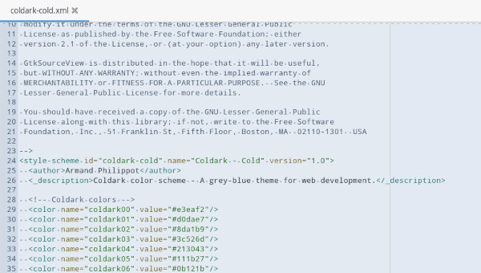
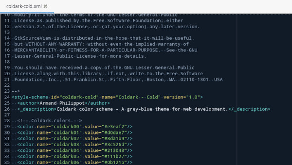
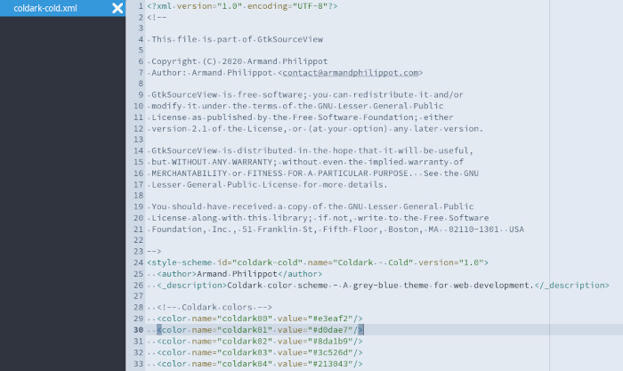
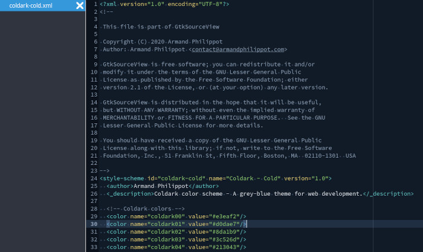
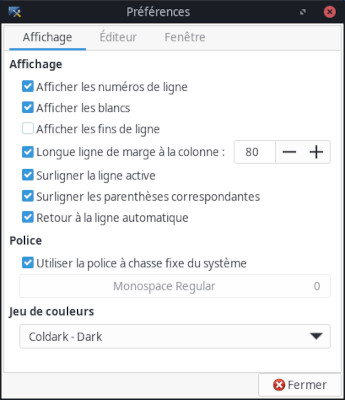

    

# Coldark GTK Source View

 

An optimized theme for web development that comes with two versions: light & dark.

## Presentation

[Coldark](https://github.com/ArmandPhilippot/coldark/) is a gray-blue theme. The colors used respect the Web Content Accessibility Guidelines (WCAG) in order to provide sufficient reading comfort. However, with opacity, it is possible that some contrasts are diminished and that they are above level AA.

This Coldark version is designed for [GtkSourceView](https://wiki.gnome.org/Projects/GtkSourceView)-based text editors like [Mousepad](https://github.com/codebrainz/mousepad) & [Gedit](https://wiki.gnome.org/Apps/Gedit).

## Colors

Coldark consists of three color palettes. The first is common to both versions. The other two each apply to a version.

The colors differ slightly from VS Code since the scopes are not the same. In addition, it is not possible to play with the opacity.

### Light Theme

| Hex Code | Preview | Description | Denomination |
| :-: | :-: | --- | :-: |
| `#e3eaf2` | ![#e3eaf2][#e3eaf2] | **Default background** | `coldark00` |
| `#d0dae7` | ![#d0dae7][#d0dae7] | **Line Highlight & Gutter background** | `coldark01` |
| `#8da1b9` | ![#8da1b9][#8da1b9] | **Selection background** | `coldark02` |
| `#3c526d` | ![#3c526d][#3c526d] | **Comments** - Invisible, Ignored, Placeholder, Unfocused selection foreground. | `coldark03` |
| `#213043` | ![#213043][#213043] | **Not used** | `coldark04` |
| `#111b27` | ![#111b27][#111b27] | **Default foreground** | `coldark05` |
| `#0b121b` | ![#0b121b][#0b121b] | **Not used** | `coldark06` |
| `#f0f4f8` | ![#f0f4f8][#f0f4f8] | **Background pattern** | `coldark07` |
| `#006d6d` | ![#006d6d][#006d6d] | **Cyan** - Merge incoming content, Parameters, Tags, Support constant, CSS Variables, Markup inline raw, Punctuation Section Embedded (e.g. `<?php ?>`) | `coldark08` |
| `#755f00` | ![#755f00][#755f00] | **Yellow** - Modified, Hints, Integers, Boolean, Constants Language, Attribute Names, Shell Case Patterns, Markup Link URL | `coldark09` |
| `#005a8e` | ![#005a8e][#005a8e] | **Blue** - Badges, Buttons, Find Match, Info, Merge current content, Selection (outside editor), Status bar (folder open), Namespaces, Classes, Variables, Constants Other, Markup Headings, Property names | `coldark10` |
| `#116b00` | ![#116b00][#116b00] | **Green** - Added elements, Strings, CSS Colors, CSS Font names, Markup Link Text | `coldark11` |
| `#af00af` | ![#af00af][#af00af] | **Magenta** - Untracked elements, Token Expression value Support, Regular Expressions, Escape Characters, Constant Characters, Storage Modifiers, Instances, Markup List Punctuation, CSS values | `coldark12` |
| `#7c00aa` | ![#7c00aa][#7c00aa] | **Purple** - Unverified, Functions, CSS Classes & IDs | `coldark13` |
| `#a04900` | ![#a04900][#a04900] | **Orange** - Warnings, Status bar (debugging), Keywords, Storage, CSS Pseudo elements | `coldark14` |
| `#c22f2e` | ![#c22f2e][#c22f2e] | **Red** - Errors, Deleted, Invalids, Deprecated | `coldark15` |

### Dark Theme

| Hex Code | Preview | Description | Denomination |
| :-: | :-: | --- | :-: |
| `#111b27` | ![#111b27][#111b27] | **Default background** | `coldark00` |
| `#213043` | ![#213043][#213043] | **Line Highlight background** | `coldark01` |
| `#3c526d` | ![#3c526d][#3c526d] | **Selection background** | `coldark02` |
| `#8da1b9` | ![#8da1b9][#8da1b9] | **Comments** - Invisible, Ignored, Placeholder, Unfocused selection foreground. | `coldark03` |
| `#d0dae7` | ![#d0dae7][#d0dae7] | **Not used** | `coldark04` |
| `#e3eaf2` | ![#e3eaf2][#e3eaf2] | **Default foreground** | `coldark05` |
| `#f0f4f8` | ![#f0f4f8][#f0f4f8] | **Not used** | `coldark06` |
| `#0b121b` | ![#0b121b][#0b121b] | **Gutter & Background Pattern** | `coldark07` |
| `#66cccc` | ![#66cccc][#66cccc] | **Cyan** - Merge incoming content, Parameters, Tags, Support constant, CSS Variables, Markup inline raw, Punctuation Section Embedded (e.g. `<?php ?>`) | `coldark08` |
| `#e6d37a` | ![#e6d37a][#e6d37a] | **Yellow** - Modified, Hints, Integers, Boolean, Constants Language, Attribute Names, Shell Case Patterns, Markup Link URL | `coldark09` |
| `#6cb8e6` | ![#6cb8e6][#6cb8e6] | **Blue** - Badges, Buttons, Find Match, Info, Merge current content, Selection (outside editor), Status bar (folder open), Namespaces, Classes, Variables, Constants Other, Markup Headings, Property names | `coldark10` |
| `#91d076` | ![#91d076][#91d076] | **Green** - Added elements, Strings, CSS Colors, CSS Font names, Markup Link Text | `coldark11` |
| `#f4adf4` | ![#f4adf4][#f4adf4] | **Magenta** - Untracked elements, Token Expression value Support, Regular Expressions, Escape Characters, Constant Characters, Storage Modifiers, Instances, Markup List Punctuation, CSS values | `coldark12` |
| `#c699e3` | ![#c699e3][#c699e3] | **Purple** - Unverified, Functions, CSS Classes & IDs | `coldark13` |
| `#e9ae7e` | ![#e9ae7e][#e9ae7e] | **Orange** - Warnings, Status bar (debugging), Keywords, Storage, CSS Pseudo elements | `coldark14` |
| `#cd6660` | ![#cd6660][#cd6660] | **Red** - Errors, Deleted, Invalids, Deprecated | `coldark15` |

## Screenshots

Screenshots of an XML file with Mousepad first then Gedit.

| Light Theme | Dark Theme |
| :-: | :-: |
|  |  |
|  |  |

## Install & Activation

I use the French version of the software. It is possible that the translation of the menus that I give you does not correspond exactly to the English version of the software.

### Mousepad

1. If the folder `~/.local/share/gtksourceview-3.0/styles/` does not exist, create it. Then place the color schemes in the folder.
2. Mousepad must be closed for the new themes to be displayed the next time you open it.
3. Open Mousepad and change the theme by going to "_View_" then "_Color scheme_". You can also go to "_Edit_", then "_Preferences_". In the "_View_" tab you should see "_Color scheme_". Mousepad should recognize your new themes; all you have to do is select the one you want to use.

### Gedit

1. If the folder `~/.local/share/gedit/styles/` does not exist, create it. Then place the color schemes in the folder.
2. Gedit must be closed for the new themes to be displayed the next time you open it.
3. Open Gedit and change the theme by going to "_Preferences_" then "_Fonts & Colors_". Gedit should recognize your new themes; all you have to do is select the one you want to use.

### Other softwares

It is undoubtedly possible to proceed in the same way for another software using GTKSourceView. Unless I am mistaken, the themes are compatible with versions 2, 3 and 4 of GTKSourceView.

## Disclaimer

- I only tested the theme on Manjaro Linux and with Mousepad & Gedit: it is possible that some elements are not correctly incorporated within other text editors.
- I have not tested the versions with all possible languages, only with those that I use commonly.

Tested with:

- HTML
- CSS / SCSS
- Javascript
- JSON
- PHP
- Markdown
- Shell script

I have also tried adding support for the following languages:

- Diff files
- Makefile
- Python
- Rust
- TOML

## License

This project is open source and available under the [LGPLv2.1 License](https://github.com/ArmandPhilippot/coldark-gtksourceview/blob/master/LICENSE).

<!-- REFERENCES -->

<!-- UI Colors -->

[#f0f4f8]: https://placehold.it/20/f0f4f8/000000?text=+
[#e3eaf2]: https://placehold.it/20/e3eaf2/000000?text=+
[#d0dae7]: https://placehold.it/20/d0dae7/000000?text=+
[#8da1b9]: https://placehold.it/20/8da1b9/000000?text=+
[#3c526d]: https://placehold.it/20/3c526d/000000?text=+
[#213043]: https://placehold.it/20/213043/000000?text=+
[#111b27]: https://placehold.it/20/111b27/000000?text=+
[#0b121b]: https://placehold.it/20/0b121b/000000?text=+

<!-- Syntax - Light Theme Colors -->

[#c22f2e]: https://placehold.it/20/c22f2e/000000?text=+
[#116b00]: https://placehold.it/20/116b00/000000?text=+
[#755f00]: https://placehold.it/20/755f00/000000?text=+
[#005a8e]: https://placehold.it/20/005a8e/000000?text=+
[#af00af]: https://placehold.it/20/af00af/000000?text=+
[#006d6d]: https://placehold.it/20/006d6d/000000?text=+
[#7c00aa]: https://placehold.it/20/7c00aa/000000?text=+
[#a04900]: https://placehold.it/20/a04900/000000?text=+

<!-- Syntax - Dark Theme Colors -->

[#cd6660]: https://placehold.it/20/cd6660/000000?text=+
[#91d076]: https://placehold.it/20/91d076/000000?text=+
[#e6d37a]: https://placehold.it/20/e6d37a/000000?text=+
[#6cb8e6]: https://placehold.it/20/6cb8e6/000000?text=+
[#f4adf4]: https://placehold.it/20/f4adf4/000000?text=+
[#66cccc]: https://placehold.it/20/66cccc/000000?text=+
[#c699e3]: https://placehold.it/20/c699e3/000000?text=+
[#e9ae7e]: https://placehold.it/20/e9ae7e/000000?text=+
